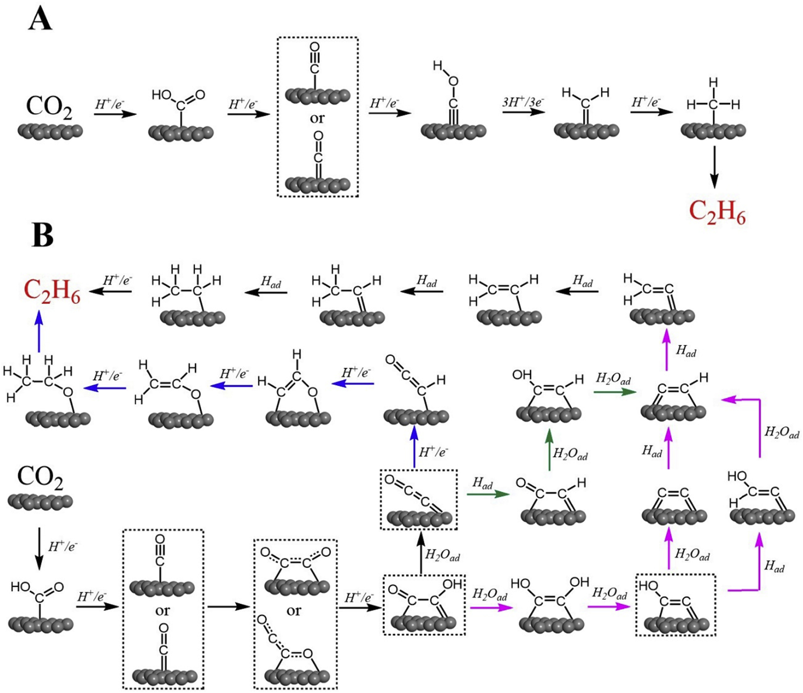

# Ethane pathway

reference: 
1. https://doi.org/10.1016/j.mtener.2018.10.003

 
## A. CH2 coupling and hydrogenation pathway
1. COOH
2. CO
3. COH
4. CH2
5. CH3
6. C2H6

## B.CO dimerization pathway
1. COOH
2. CO
3. OCCO (C-C coord)
4. OCCO (C-O coord)
5. OCCOH

### Branch I
1. OCC (45 degree tilted)
2. OCCH
3. CHCHO (C-O coord)
4. CH2COH(O coord)
5. CH3CH2O
6. C2H6

### Branch II-A
1. HOCCOH
2. HOCC
3. CC
4. CCH

### Branch II-B
(after II-A-2: HOCC) 
1. HOCHC
back to CCH

### Branch II-C
(after I-1: OCC)
1. OCCH
2. OHCCH
back to CCH

Continue from CCH:
1. CH2C
2. CH2CH
3. CH3CH
4. CH3CH2
5. C2H6

