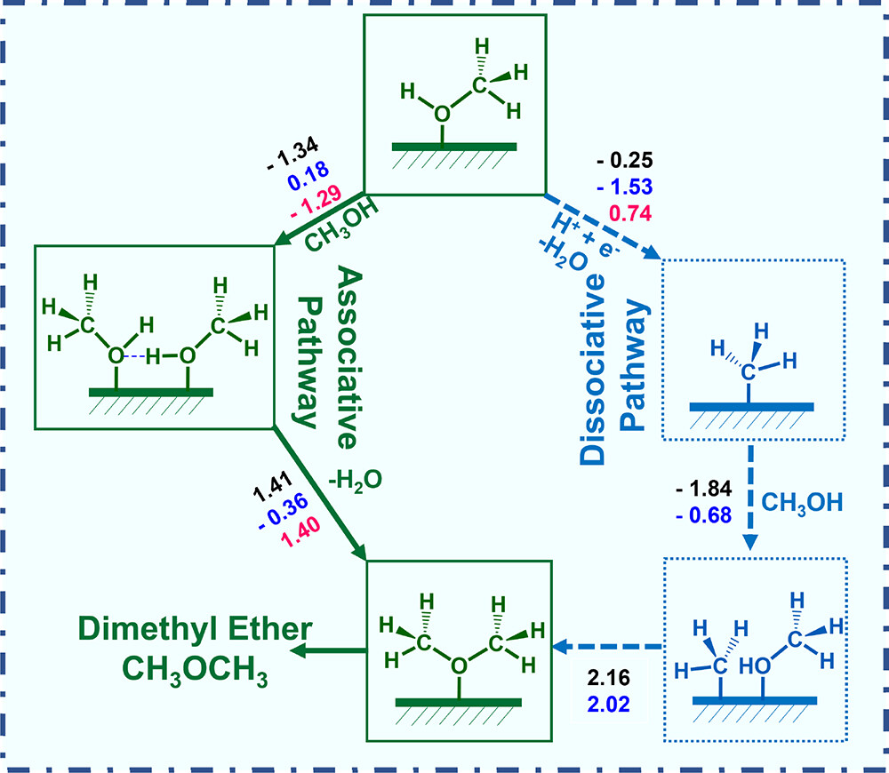

# CO2RR to CH3OCH3 (dimethyl ether)

1. First C1 to CH3OH
1. Associative pathway has no more electron transfer step.
1. Dissociative pathway has one dissociation step of CH3OH to CH3, which
   involves one electron transfer step.
1. Independently build each intermediate on surface, then final product
   CH3OCH3 on surface.

