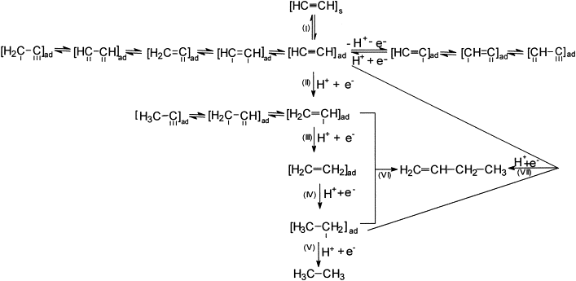
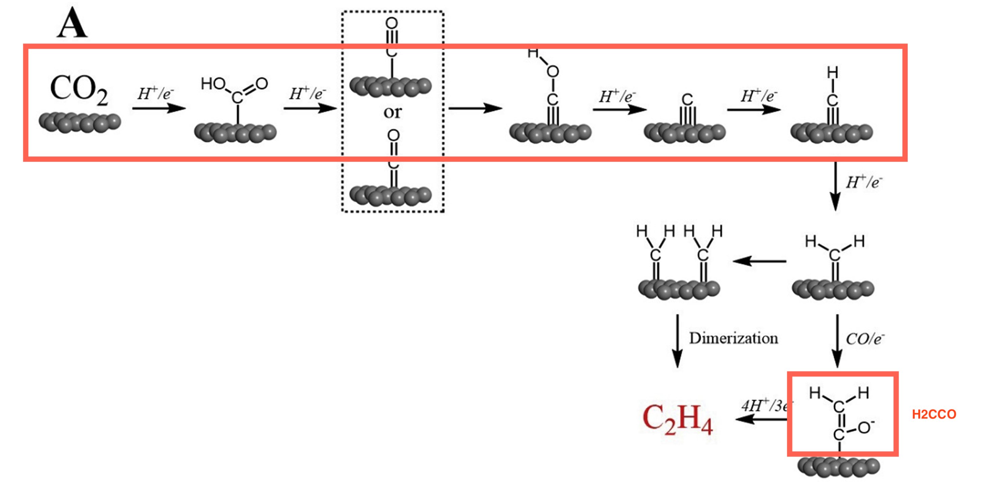
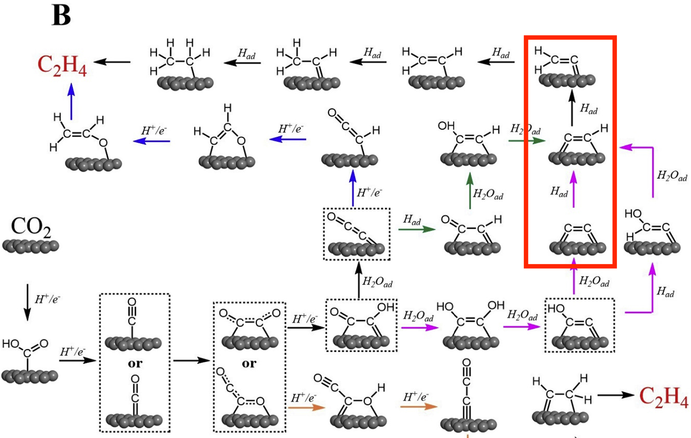
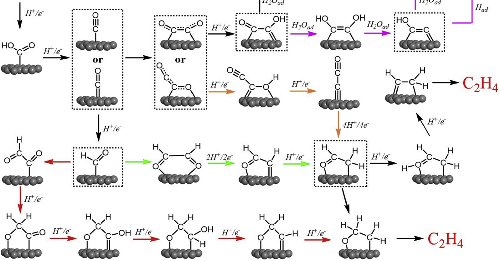

# Ethyne pathways

Since oxidation state of carbon in ethyne is higher than that in ethylene, the production of ethyne means a less completed reduction from CO2.

The key is to check the energy preferences between forming HCCH and H2CCH.

## A

Shares with C2H4-CH2 dimerization pathway until formation of CH, where two adjacent CH undergo direct dimerization into ethyne.

H2CCO_C was added as another pathway to form C2H4.

## B

C2H4-CO dimerization pathway, outline in red:

1. CC
2. CCH
3. ethyne compete with CH2C

or (pathway in yellow arrows)

1. OCCO_CO
2. OCCOH_CO
3. OCC_v ("v" for "vertical")
4. OCC_v to CHOCH2 vs. OCC reduce to HCCH

## C

(pathway in green arrows)

CHO dimerization:

1. 2xCHO
2. CHOCHO
3. CHOCH
4. CHOCH reduced to CHOCH2 with H+/e- vs. CHOCH breaks the C=O bond to form HCCH

Energy of HCCH2: the further reduction of HCCH.
