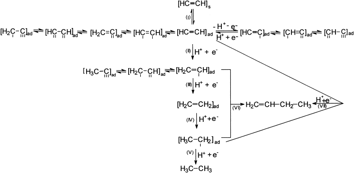

# Group Meeting
## 07/12/22
---

# Modelling of Ethyne Pathway
---

# Ethane, Ethylene and Ethyne

1. Key intermediates: <code>H2C=CH</code>
1. Discuss the preference to <code>H2C=CH</code> over `CH=CH`
1. Preference of ethane, ethylene and ethyne in terms of energy profile.

> Reference:
> 1. Journal of Electroanalytical Chemistry 519 (2002) 101–110
---

# CO2 reduction to Ethyne pathway

1. Compared to ethylene, carbon in ethyne is at a **higher oxidation state**. 
1. Reduction from <code>CO2</code> to ethyne: **incomplete reduction** to ethylene.
1. Not practicable to get ethyne back from ethylene: It is an **oxidation**.
1. Distinguish the key diverging stages in the **ethylene** pathway.

> Reference: 
> 1. https://doi.org/10.1016/j.mtener.2018.10.003
---
# Ethlyene Pathway A: CH2 coupling

This pathway shares a high similarity to the one in [ethane-CH2 coupling](../ethane/README.md). 
The `CH` dimerization instead of `CH2` dimerization could be a potential way to produce `C2H2`.

---
# Ethlyene Pathway B: CO dimerization-1

1. This path has already been covered mostly in the [ethane-CO dimerization](../ethane/README.md) part. 
2. <b style="color:blue">Blue</b>, <b style = "color: purple">purple</b>, <b style = "color: green">green</b> arrow indicated paths are the same except the final product, which can easily direct to the discussion of formation difficulty for ethane, ethylene and ethyne.

---
# Ethlyene Pathway B: CO dimerization-2

1. The <b style="color: red">red</b> path has been modelled in our very first `GDY-SAC-CO2RR-C2` attempt. The <b style="color:orange">orange</b> path is a different way for CO dimerization. The <b style="color:lightgreen">lightgreen</b> path is a diverged path from the <b style="color: red">red</b> one with a `CHO` dimerization.
2. The `O` bonded configurations might be too hard to be detached early into ethyne phase.
---
# Plan
1. Add the adsorbates related to pathway to ethylene, and their corresponding alternatives for ethyne formation.
1. Based on #1, figure out the adsorption strength and energy profile, and discuss the reaction preference of the pathways

